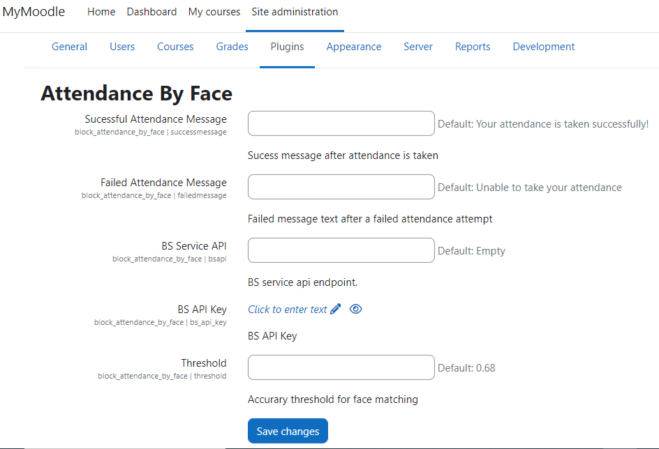
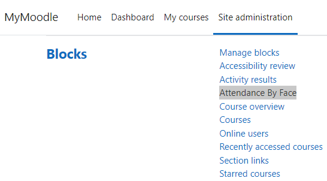
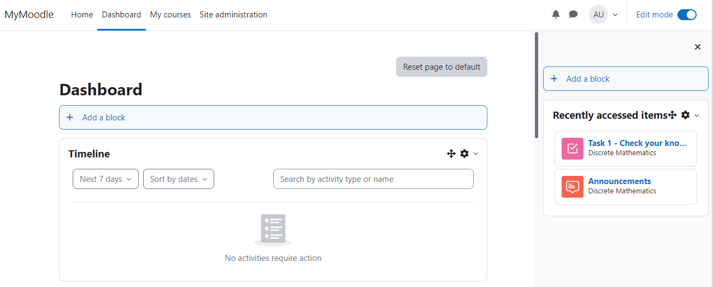
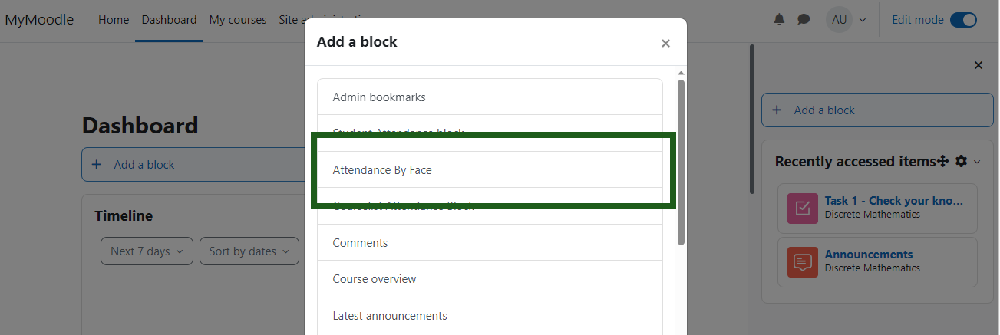
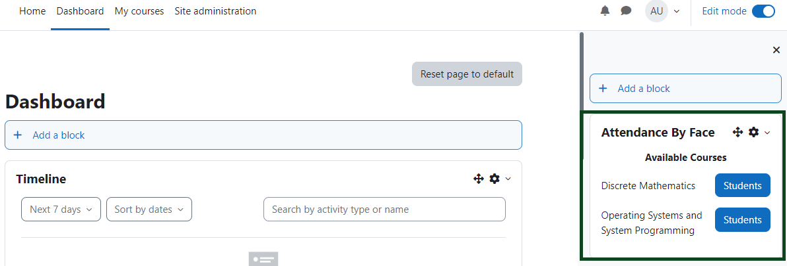
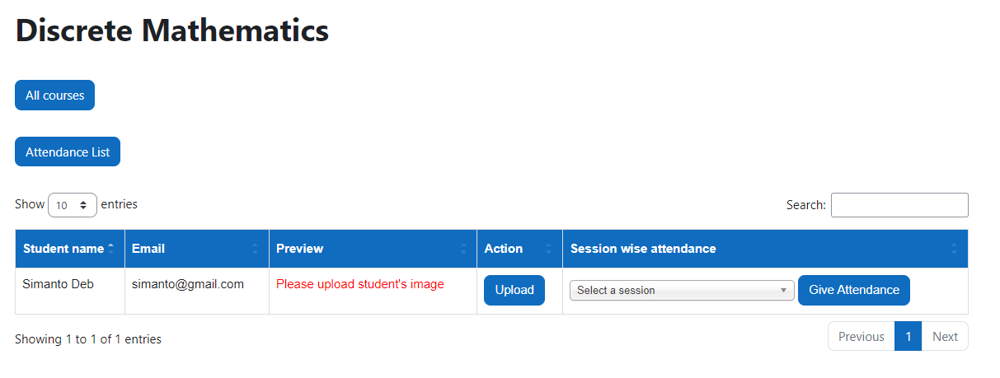
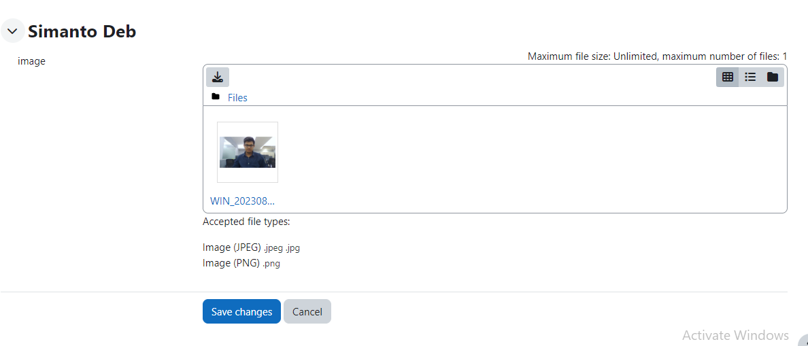
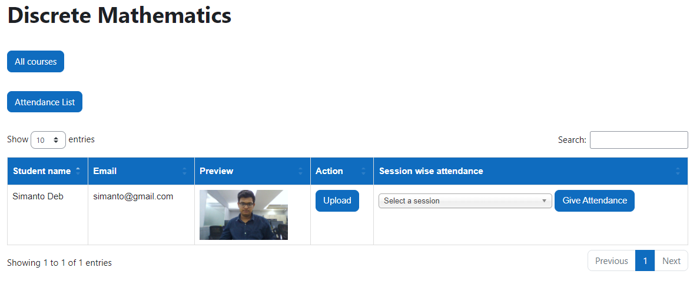
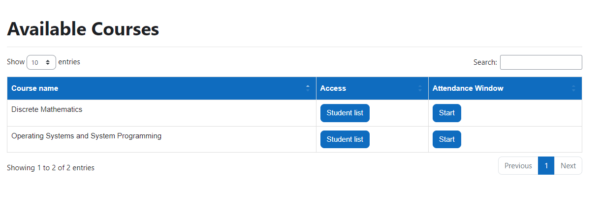
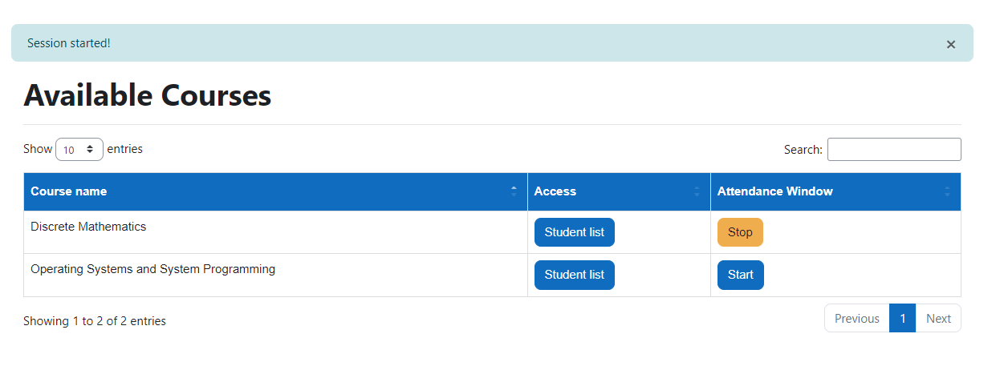

# Block-Attendance

<p align="center">
  <a href="" rel="noopener">
 </a>
</p>

<h3 align="center">Moodle-Block Attandance By Face</h3>

<div align="center">

[]()
[](https://github.com/Prosanto7/Block-Attendance/issues)
[](https://github.com/Prosanto7/Block-Attendance/pulls)
[](/LICENSE)

</div>

<p align="center"> Uses Face recognition to give student attandance using block plugin
    <br> 
</p>

## 🧐 About <a name = "about"></a>

Within this plugin, students have the capability to mark their attendance for individual courses by simply clicking the designated attendance button. This action is only permissible during an ongoing session initiated by the instructor for the respective course. Upon activation, a modal window will be launched. Within this modal, the webcam functionality will be activated, capturing student photos for comparative analysis. These images will then be matched against the images uploaded by the teacher into the Moodle database.

## 🏁 Getting Started <a name = "getting_started"></a>
Welcome to the installation guide for <b>Attendance By Face</b>, block plugin. Following these instructions will enable you to obtain a copy of the project and successfully run it on your machine.

### Install by downloading the ZIP file

- Download zip file from <a target="_blank" href="https://moodle.org/plugins/block_attendance_by_face">Moodle plugins directory</a> or <a target="_blank" href="https://github.com/Prosanto7/Block-Attendance">GitHub</a>.

- Unzip the zip file inside blocks folder of your moodle project directory.

```
{moodle folder}/blocks/
```
 <b>or</b>
  
   - Upload the zip file in the install plugins options from site administration.

```
Site Administration ➜ Plugins ➜ Install Plugins ➜ Upload zip file
```

In your Moodle site (as admin), Visit site administration to finish the installation.

### Install using git clone

Go to moodle project directory

```
cd {moodle folder}/blocks/
```

and clone code by using following commands:
```
git clone https://github.com/Prosanto7/Block-Attendance
```

## ⚙️ Configuration

After installing the plugin, you will get a list of option in the settings page. 



### Settings

To update the plugin settings, navigate to plugin settings

```
Site Administration ➜ Plugins ➜ Blocks ➜ Attendance By Face
```



## 💡 How to use

### Adding the block plugin
 - To add the block plugin enable <b>Edit Mode</b> at dashboard.
 

 - Select the block plugin named as <b>Attendance By Face</b> from this list.
 

 - Block plugin is added successfully.
 

 ### Adding student's image

- Clicking the <b>students</b> button will redirect to the list of students page.


- Clicking the <b>upload</b> button will take the user to the upload file page.
 

- After saving the student's picture a preview of that picture will be visible in the student table.


### Starting session for a course

- Clicking the <b>students</b> button will redirect to the list of students page.


- Then click <b>All Courses</b> button to see list of courses. Then click <b>Start</b> button to start a session for the specific course.


- Session is started.


### Giving attendance from student's end
