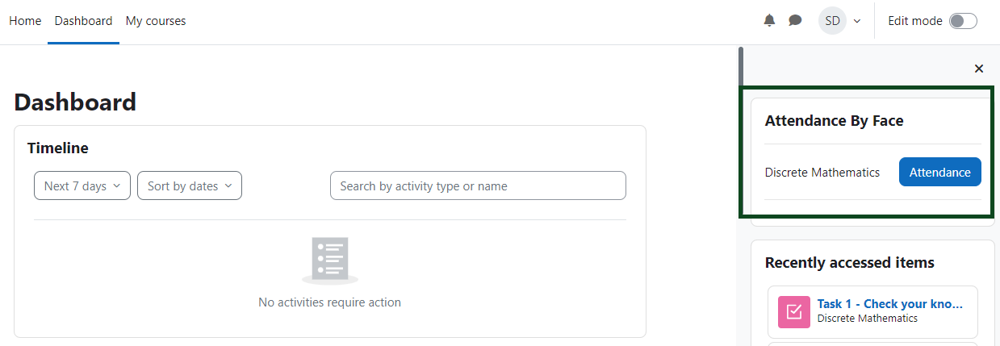
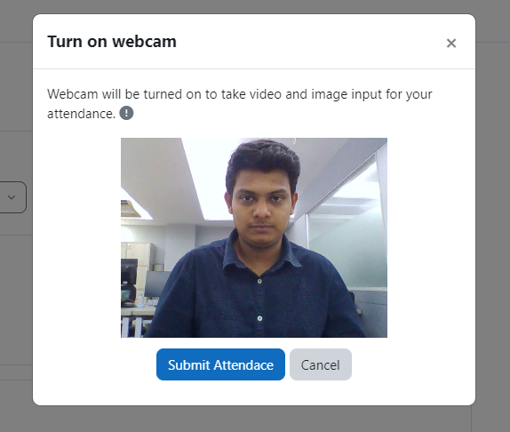
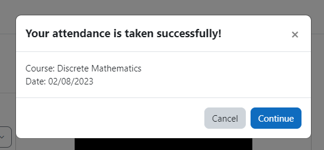
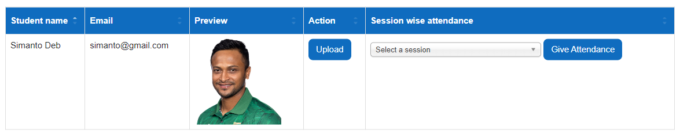
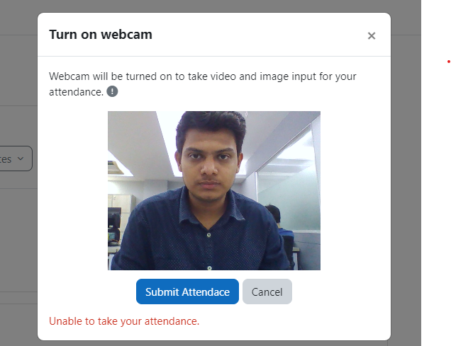
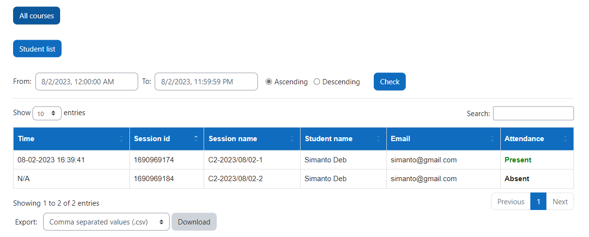

# Block-Attendance

<p align="center">
  <a href="" rel="noopener">
 </a>
</p>

<h3 align="center">Moodle-Block Attandance By Face</h3>

<div align="center">

[]()
[](https://github.com/Prosanto7/Block-Attendance/issues)
[](https://github.com/Prosanto7/Block-Attendance/pulls)
[](/LICENSE)

</div>

<p align="center"> Uses Face recognition to give student attandance using block plugin
    <br> 
</p>

## 🧐 About <a name = "about"></a>

Within this plugin, students have the capability to mark their attendance for individual courses by simply clicking the designated attendance button. This action is only permissible during an ongoing session initiated by the instructor for the respective course. Upon activation, a modal window will be launched. Within this modal, the webcam functionality will be activated, capturing student photos for comparative analysis. These images will then be matched against the images uploaded by the teacher into the Moodle database.

## 🏁 Getting Started <a name = "getting_started"></a>
Welcome to the installation guide for <b>Attendance By Face</b>, block plugin. Following these instructions will enable you to obtain a copy of the project and successfully run it on your machine.

### Install by downloading the ZIP file

- Download zip file from <a target="_blank" href="https://moodle.org/plugins/block_attendance_by_face">Moodle plugins directory</a> or <a target="_blank" href="https://github.com/Prosanto7/Block-Attendance">GitHub</a>.

- Unzip the zip file inside blocks folder of your moodle project directory.

```
{moodle folder}/blocks/
```
 <b>or</b>
  
   - Upload the zip file in the install plugins options from site administration.

```
Site Administration ➜ Plugins ➜ Install Plugins ➜ Upload zip file
```

In your Moodle site (as admin), Visit site administration to finish the installation.

### Install using git clone

Go to moodle project directory

```
cd {moodle folder}/blocks/
```

and clone code by using following commands:
```
git clone https://github.com/Prosanto7/Block-Attendance
```

## ⚙️ Configuration

After installing the plugin, you will get a list of option in the settings page. 


### Settings

To update the plugin settings, navigate to plugin settings

```
Site Administration ➜ Plugins ➜ Blocks ➜ Attendance By Face
```


## 💡 How to use

### <span id='add-plugin'>Adding the block plugin</span>
 - To add the block plugin enable <b>Edit Mode</b> at dashboard.
 

 - Select the block plugin named as <b>Attendance By Face</b> from this list.
 

 - Block plugin is added successfully.
 

 ### Adding student's image

- Clicking the <b>students</b> button will redirect to the list of students page.


- Clicking the <b>upload</b> button will take the user to the upload file page.
 

- After saving the student's picture a preview of that picture will be visible in the student table.


### Starting session for a course

- Clicking the <b>students</b> button will redirect to the list of students page.


- Then click <b>All Courses</b> button to see list of courses. Then click <b>Start</b> button to start a session for the specific course.


- Session is started.


### Giving attendance from student's end

- Student have to add the block plugin as the same way mentioned before. <a href='#add-plugin'>Click to see</a>

- For a running session the course name will apear at this block with an <b>Attendance</b> button.


- Clicking on the <b>Attendance</b> button will open a modal that will ask permission to start the webcam and after giving permission student will be able to give attendance.




``` 
Successsfull Message 
```


```
Failure Message for wrong credentials
```




### Giving attendance from teacher's end
- Teachers can simply select the particular session from the students list and enter <b>Give attendance</b> button.

## Attendance List
From the list of students user can navigate to list of attendance by clicking <b>Attendance List</b> button.




## FAQ’s:
1. How can I upload a student image? 
  
    > At the list of students, an **upload** button is given to upload student image.
2. How can I give attendance manually? 
  
    > At the list of students, **Give attendance** button is given to give attendance manually. Remember to select the correct session first. 

3. Can the students upload their own images? 
    
    > No, only admins can access. 
4. Where can I get the BS Service API credentials? 
    
    > Please contact here: elearning@brainstation-23.com for a trial key.
5. As a student, why can’t I validate my face to give attendance? 
    > Student’s image must be uploaded by an admin in the moodle to validate their face.
6. Why my students can't see any message when they click on the attendance button?
    > Please inform them to refresh the site and try again.
7. Why my student's are getting failed messages?
    > Every user image and object in front of the webcam needs to have a face that can be detected. Please make sure the image is bright enough and there is no multiple face in that image.